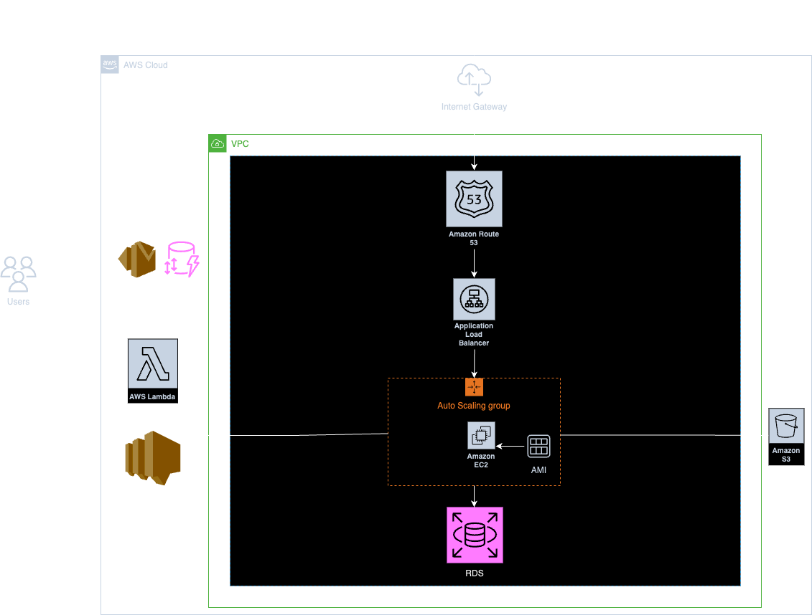

# Cloud Computing Web Project

## Overview

This repository encompasses a multi-tiered web application built with Spring Boot, designed to demonstrate a cloud-native architecture using various AWS services. The project features user management with email verification, document storage and management, and infrastructure provisioning with CloudFormation. Additionally, serverless components via AWS Lambda are employed for automated email services.

## Features

### Web Application

- **User Management:** Facilitates the creation and verification of user accounts. Verification is done through email, ensuring that only authenticated users can access certain endpoints.
- **Document Management:** Users can manage their documents through the application. This includes creating, updating, deleting, and retrieving documents, which are stored in AWS S3.
- **Email Service Integration:** Utilizes AWS SNS to trigger Lambda functions for sending verification emails via AWS SES. The emails and tokens are recorded in DynamoDB.

### Infrastructure as Code

- **AWS CloudFormation:** Used to define and provision the AWS resources needed for the application. This includes networking components like VPCs and subnets, auto-scaling groups for handling load, and an RDS instance for database services.
- **CI/CD Pipeline:** A GitHub Actions workflow is set up to create an Amazon Machine Image (AMI) on every push request, facilitating continuous deployment.

### Serverless

- **Lambda Functions:** Handles automated email notifications and maintains a log of these transactions in DynamoDB for record-keeping and auditing purposes.

## Technical Stack

- **Frontend:** Spring Boot
- **Backend:** AWS EC2, S3, RDS, Lambda
- **CI/CD:** GitHub Actions, Packer
- **Database:** AWS RDS
- **Email Service:** AWS SES, SNS
- **Infrastructure Provisioning:** AWS CloudFormation
